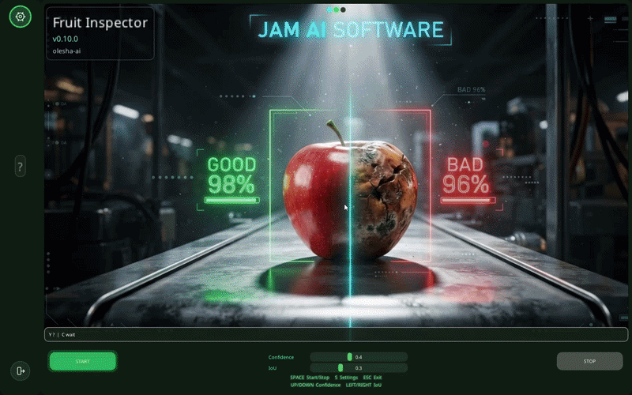
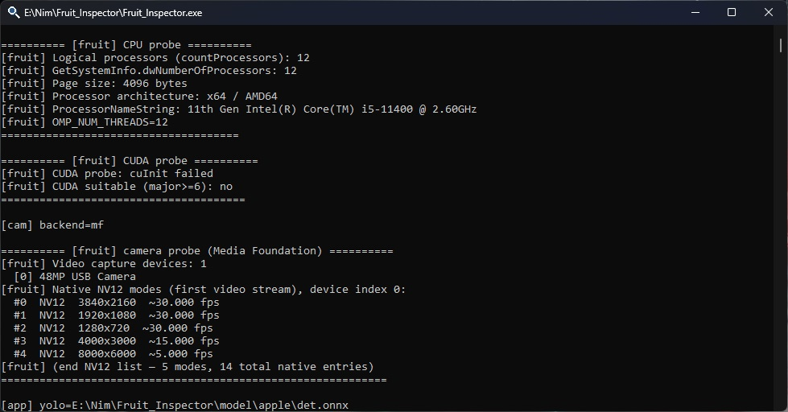
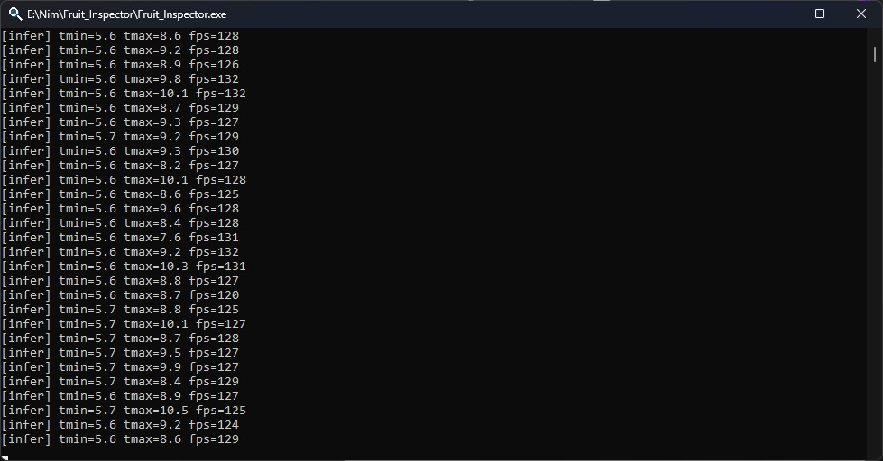

# Fruit Inspector

build **0.10.0** · Windows x64 · Nim · ONNX Runtime (CPU / OpenVINO / CUDA via `settings.json`) · line station

Fruit Inspector is **conveyor inspection**: the fruit moves on the belt; quality is graded only in the **control zone**, not anywhere in the frame.

EdgeInfer: https://github.com/olesha-ai/edgeinfer-eval

---

## Pictures

Test bench: Intel **i5-11400**, 32 GB RAM, **no discrete GPU**, USB camera 1920×1080.  
ORT **CPU** EP: infer loop on the order of **~100–130 fps** (see `speed.jpg`).  
Camera preview ~30 fps — camera limit, not infer.

---

## Idea

On the line you do not grade an apple “wherever it happens to be in the frame”. You grade it in the **control zone** — a fixed spot on the belt.

The image uses a **3×3 grid**. The **centre cell (C)** is the control zone:

- detect, track, and **stable IDs** on the line (up to two apples for now);
- **focus** — the apple closest to cell C; after it leaves C — **sticky focus** on the next ID; a new detection does not steal focus;
- **Cat (LightGBM)** — only while the focus apple’s centre is **inside C**;
- pipeline: **YOLOX** (640) → **ROI refine** (256) → **44 features** (`fruit_features`) → Cat → GOOD / BAD on screen.

---

## Station behaviour

- no full-frame chase along the belt — we work cell C and an ID queue;
- while the apple is moving toward C — detect and track only, Cat is not run;
- in C — feature collection and verdict;
- left C — sticky on the next ID, repeat.

---

## trig

On the desk, Cat starts as soon as the apple **enters** C. On a live belt that is not the final story: the fruit can still **move**, **roll**, **bounce** — the frame is already in the zone, but the **object is not ready to grade**. On the factory floor the moment is different: **stop, lying still, ready to capture**.

**trig** is groundwork for that. Not aim-by-coordinates, but a **station signal**: object ready — **grade it**. The inspector sends the verdict over the network (`GOOD` / `BAD` and ID); trig shows the result and will become a **line command** over time: stop the section → signal the model → get the grade. The archive already includes trig as a LAN client; the full chain “ready → command → Cat” is the next step.

---

## Stack

- **Nim**, **ImGui** (GLFW)
- **ONNX Runtime** — provider in **`settings.json`**: `cpu`, `openvino`, `cuda`
- **YOLOX-nano** + **LightGBM** (Cat ONNX)
- **`fruit_features.dll`** + **`features.json`** next to Cat
- apple crop pack: `model/apple/det.onnx`, `cat.onnx`, `features.json`

---

## What’s in the zip

- `Fruit_Inspector.exe`
- `fruit_features.dll`
- `lib/cpu/`, `lib/openvino/` (and `lib/cuda/` if included)
- `model/apple/`
- `settings.json`
- `trig.exe` — LAN client (see **trig**)
- `licenses/`

---

## settings.json

The file sits next to the exe. Values in the archive may be from my desk — use your own.

**Engine:** `ort_provider`, `ort_intra_threads`, `ort_inter_threads`, `openvino_*` (when using OpenVINO).

**Models and camera:** `crop_pack`, `model`, `cat_model`, `camera_index`, `conf`, `iou`, `infer_main_tensor_size`, `infer_refine_tensor_size`.

**Output and logs:** `ip_addr`, `ip_port`, `memory_diag_enabled`.

Edit the file by hand or use **Settings** → **Apply**.

---

## Run

1. Unpack locally.
2. Keep `lib/`, `model/`, `fruit_features.dll`, and `settings.json` next to `Fruit_Inspector.exe`.
3. Set `camera_index` and `ort_provider`.
4. Run from cmd if you want `[infer]` fps lines on stdout.
5. **START** / **STOP** in the UI; Esc asks before quit.

---

## License

Testing, teaching, research, feedback — yes.  
Commercial production under this license — no.  
Full text: [LICENSE.md](LICENSE.md), [licenses/Fruit_Inspector_LICENSE.md](licenses/Fruit_Inspector_LICENSE.md).  
Third-party components: [licenses/THIRD_PARTY.md](licenses/THIRD_PARTY.md). Do not remove the `licenses/` folder from the zip.

Commercial contact: olesha-ai.

Intel, OpenVINO, Microsoft, Megvii, and other names are trademarks of their respective owners.

---

olesha-ai
